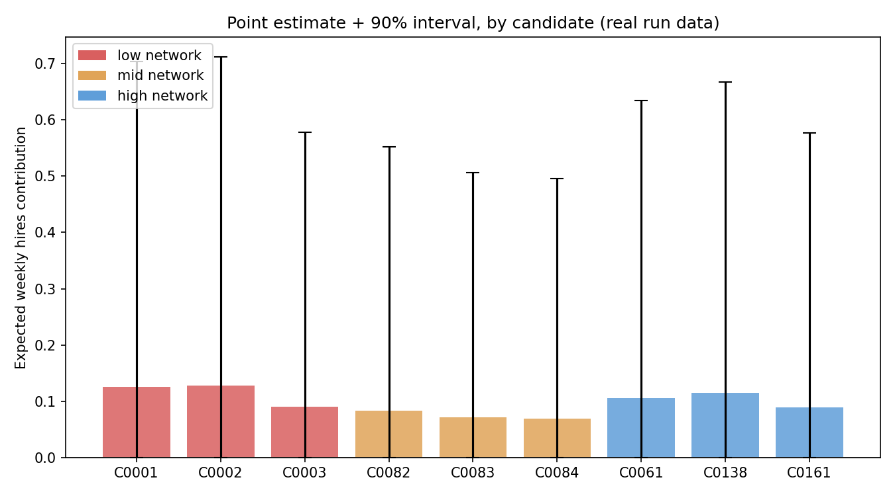

# Uncertainty Communication

*Chart above: real output from this run (`data/allocations_outcome.csv`), not illustrative numbers. Bars are the point estimate; whiskers are the 90% interval computed by `allocator.py`.*

## The plain sentence

> For a typical candidate in this run, the tool estimates something like 0.1 expected hires per week from this allocation -- but the honest range, given how few applications and conversations a single week actually produces, is roughly 0 to 0.7. Treat the number as 'plausible, not precise': useful for comparing two allocations against each other, not for predicting a specific week's outcome.

## Where I would not trust this tool

This is not a generic disclaimer -- it is the tool's own measured finding. Component 7's Hard Stop 2 check found that **213 of 213 candidates (100%)** in this run have a 90% interval wider than 1.5x their own point estimate. Candidate C0002 is the widest example here: an interval of [0.00000, 0.71142] around a point estimate of 0.12831 -- a ratio of 5.5x. **Do not trust this tool's point estimate on its own, for any candidate, as a prediction of what will actually happen in a given week.** It is more defensible as a way to compare two allocations for the SAME candidate against each other (which one is directionally better) than as a forecast of a real outcome. This is a structural limitation of modeling single-week expected value from small numbers of trials, not a bug we could tune away, and we are stating it plainly rather than hiding it behind a confident-looking point number.
